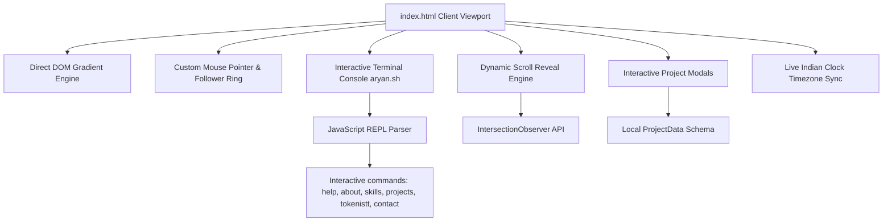

# 👨‍💻 Aryan Singh Bhadoria — Portfolio

<div align="center">
  
  
  
</div>

<br />

Welcome to the official repository of my premium developer portfolio. I build production-grade systems that ship, scale, and get adopted. I'm a **Full Stack Developer**, **Co-Founder of Tokenistt**, and **Published Researcher** in AI Governance, specializing in cost-efficient LLM integrations, decentralized networks, and spatial databases.

---

## 🔗 Quick Navigation & Socials

*   **🌐 Live Project**: [Tokenistt.com](https://tokenistt.com/)
*   **📧 Direct Contact**: [aryanbhadoria100@gmail.com](mailto:aryanbhadoria100@gmail.com)
*   **💼 LinkedIn**: [/in/aryan-singh-bhadoria-70086a28a](https://www.linkedin.com/in/aryan-singh-bhadoria-70086a28a/)
*   **🏢 Tokenistt LinkedIn**: [Tokenistt Company Page](https://www.linkedin.com/company/tokenistt)
*   **🐙 GitHub**: [@Aryan-theccool](https://github.com/Aryan-theccool)

---

## ⚡ High-Impact Accomplishments at a Glance

*   **100% LLM Cost Visibility & Budgets**: Developed a gateway proxy supporting virtual key management scoped to workspaces, real-time budget enforcement, and multi-provider routing.
*   **Published AI Governance Platform**: Author of *"Astitva: AI-Powered FRA Governance Platform"* in **IJAITR Vol. 3** for automating land claim processing with **89.2% accuracy**.
*   **AWS AI for Bharat Hackathon Finalist**: Designed and implemented *Dharohar* to safeguard indigenous traditional knowledge using AWS Bedrock and blockchain ledger audits.

---

## 🛠️ Tech Stack & Skills Matrix

| Category | Technologies & Tools |
| :--- | :--- |
| **Languages** | C++, JavaScript (ES6+), SQL (PostgreSQL) |
| **Core Web Stack** | Node.js, React.js, HTML5, Vanilla CSS3 (Glassmorphic Styles) |
| **AI & Cloud** | AWS Bedrock, AWS Transcribe, Claude API, MCP (Model Context Protocol), NLP (BERT) |
| **Data & Databases** | PostGIS (GIS), MongoDB, PostgreSQL, Smart Contract Audits |
| **Web3** | Ethereum Smart Contracts, Solidity, Decentralized Immutable Ledgers |

---

## 🚀 High-Impact Projects Featured

### 1. Tokenistt — AI Cost Gateway & Governance
*   **Description**: A drop-in OpenAI SDK replacement and gateway proxy featuring FinOps-grade cost tracking, virtual key management, budget enforcement, and intelligent multi-provider routing across Anthropic, AWS Bedrock, and Azure OpenAI.
*   **Stack**: Node.js, Express, Kafka, ClickHouse, Next.js.
*   **Links**: [Live Gateway](https://tokenistt.com)

### 2. DeRisk.biz — Governance Risk AI
*   **Description**: Private AI risk intelligence platform for CXOs to assess and detect corporate governance and internal data exposure vulnerabilities before regulators do.
*   **Stack**: React, Node.js, Express, OpenAI API.
*   **Links**: [Live Site](https://derisk-biz.onrender.com/)

### 3. Dharohar — Traditional Knowledge Protection
*   **Description**: AWS AI National Finalist platform designed to catalog, verify, and digitize traditional Indian wellness formulations to prevent biopiracy and distribute royalties fairly.
*   **Stack**: AWS Bedrock, AWS Transcribe, Ethereum Smart Contracts, Solidity, React.
*   **Links**: [Live Demo](https://frontend-nine-pink-57.vercel.app/)

### 4. RealtimeGuard — Fraud Monitoring & Payments
*   **Description**: High-throughput financial transaction monitor operating with sub-second latency for PMLA compliance, query audits, and SecureFin X gateway integration.
*   **Stack**: Node.js, WASM, WebSockets, Ethereum, PostgreSQL.
*   **Links**: [SecureFin X Demo](https://securefin-x-realtimeguard.vercel.app/) | [Legacy UI Demo](https://realtimeguard-legacy.vercel.app/) (admin/admin)

### 5. Mysha Creation — Premium Fashion E-Commerce
*   **Description**: A premium direct-to-consumer boutique Indian apparel storefront featuring shoppable reels, curated occasion collections, and secure Razorpay payment integration.
*   **Stack**: Next.js 14, TailwindCSS, MongoDB, Razorpay API.
*   **Links**: [Live Site](https://onestoremysha.com)

### 6. AI Resume Screener & Ranking Tool
*   **Description**: Recruiter-grade candidate screening and ranking application. Parses candidate resumes (PDF/DOCX) using natural language processing and matches capabilities with Job Descriptions via TF-IDF and Cosine Similarity.
*   **Stack**: React, NLP, PDF/DOCX Parsing.
*   **Links**: [Live Demo](https://screen-screeing.vercel.app/)

### 7. Local AI LaTeX Resume Editor
*   **Description**: Offline resume-tailoring editor featuring a glassmorphic UI, FastAPI backend, and local offline LLMs running via Ollama. Resolves simple edits in under a millisecond using regex fast-path routing.
*   **Stack**: FastAPI, Ollama (phi3, mistral), TailwindCSS, Vanilla JS.
*   **Links**: [GitHub Repository](https://github.com/Aryan-theccool/Resume-editor)

### 8. Astitva — Forest Rights Act (FRA) AI Governance
*   **Description**: A published AI-powered platform (IJAITR Vol. 3) to automate forest land rights claim validation with 89.2% accuracy. Integrates OCR scanners, document classification networks, and GIS mapping tools.
*   **Stack**: BERT NLP, OCR, PostGIS, MongoDB.
*   **Key Paper**: Published in *International Journal of Advanced Information Technology and Research (IJAITR) Vol. 3*.

### 9. Inkspace — Infinite Collaborative Whiteboard
*   **Description**: Infinite canvas whiteboard with low-latency WebSockets multiplayer sync, RoughJS sketching aesthetic, and screen-to-world linear mouse viewport math.
*   **Stack**: Next.js 14, Zustand, Yjs, Liveblocks, RoughJS.
*   **Links**: [Live Demo](https://task-eight-psi-64.vercel.app/) | [GitHub Repository](https://github.com/Aryan-theccool/Big-market-/blob/main/README.md)

---

## 🏆 Achievements & Leadership

*   **Top 5 National Rank — AWS AI for Bharat Hackathon**: Placed in the top 5 nationwide competing against over 1,000 teams.
*   **Runner-Up — Void Hack 7.0**: Finished 2nd place in the Full Stack track at this 24-hour national hackathon.
*   **National Finalist — IISF Government Hackathon**: Reached the final stage of the Chandigarh-based government initiative.
*   **National Finalist — SolveX Hackathon**: Qualified as a national finalist.
*   **4th Place — VGI Innovik Hackathon 5.0**: Secured 4th place at the national level event.
*   **Inter-House & Inter-School Volleyball Champion (Captain)**: Led the volleyball team to championship victory, captaining 12 members.
*   **Inter-House Cricket Champion (Captain)**: Captained the house cricket team to victory in the tournament.

---

## 🎨 Portfolio Architecture & Interactive Features

This portfolio is hand-coded to achieve maximum runtime performance (**100/100 Lighthouse Performance Index**) by avoiding heavy framework layers while rendering complex fluid UI elements.



### Key Performance Innovations in Code:
1.  **Fluid Liquid Gradient (Zero-React-Lag)**:
    *   *The Problem*: Standard reactive mouse-move styling creates extreme re-render lag.
    *   *The Solution*: Implemented direct SVG matrix transformations (`#blurMe` feGaussianBlur + feColorMatrix) mapped directly on the cursor coordinate event listener, skipping high-level framework repaint layers completely.
2.  **Custom Javascript Interactive Shell (`aryan.sh`)**:
    *   An interactive UNIX-style terminal simulator built into the DOM. Try commands like:
        ```bash
        $ help
        $ about
        $ skills
        $ projects
        $ tokenistt
        $ contact
        ```
3.  **Scroll Animations**:
    *   High-performance scrolling effects using the native browser `IntersectionObserver` API rather than massive custom scroll libraries.
4.  **Timezone Live Clock**:
    *   Built-in ticker synchronizing directly with Indian Standard Time (`IST` timezone representation) using `Intl.DateTimeFormat` configurations.

---

## 📂 Repository File Structure

```text
├── index.html              # Main premium portfolio page (performant animations & interactive scripts)
├── Mythos-Fixed.html       # Backup / Stable release branch with direct DOM binding fix
├── Aryan portfolio.html    # Legacy template framework
├── Aryan resume.pdf        # Downloadable academic and professional resume
├── README.md               # Extensive project catalog & codebase walkthrough (this file)
└── .gitignore              # standard ignore configurations
```

---

## 🚀 Running the Portfolio Locally

Since the portfolio is written using pure vanilla web standards (HTML5, Vanilla CSS3, ES6+ Javascript), running it requires zero package installations or dependency management.

### Method 1: Double Click
1.  Clone this repository:
    ```bash
    git clone https://github.com/Aryan-theccool/Aryan-portfolio.git
    ```
2.  Navigate to the repository folder and double-click `index.html`. It will open instantly in any modern web browser.

### Method 2: Local HTTP Server (Recommended for development)
To run with a live-reloading server, use Python's built-in static server or Node's `serve`:

*   **Using Python**:
    ```bash
    python -m http.server 8000
    ```
    Open `http://localhost:8000` in your browser.

*   **Using Node.js**:
    ```bash
    npx serve .
    ```
    Open `http://localhost:3000` in your browser.

---

## 🎓 Education & Credentials

*   **B.Tech in Computer Science and Information Technology (CSIT)**
    *   *Institution*: Acropolis Institute of Technology and Research (AITR), Indore (2023 - 2027)
    *   *Academic Standing*: **CGPA: 7.4**
*   **Class 12th Secondary Education**
    *   *Score*: **90.6%** (2023)
*   **Class 10th Primary Education**
    *   *Score*: **91.4%** (2021)

---

<div align="center">
  <p><b>"Building production-grade systems that ship and scale."</b></p>
  <sub>© 2025-2026 Aryan Singh Bhadoria. All Rights Reserved.</sub>
</div>
